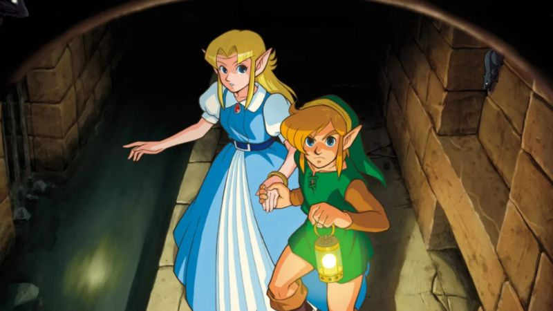

### Présentation

**The Legend of Zelda : A Link to the Past Project** est un remake du jeu classique et emblématique de la **Super Nintendo (SNES)**, initialement sorti en *1991* (*1992* en *Europe*), revisité sur la **Game Boy Advance** en *2002* aux côtés de **The Legend of Zelda : Four Swords**, un jeu multijoueur.

**The Legend of Zelda : A Link to the Past** sera réédité à plusieurs reprises sur diverses consoles Nintendo et recevra également un jeu hommage sur la **Nintendo 3DS**, intitulé **The Legend of Zelda : A Link Between Worlds**, reprenant des idées de gameplay, le voyage entre deux mondes, dans une histoire originale avec des idées de gameplay modernisées !

### Description

Ce remake, réalisé avec Solarus, utilise les éléments graphiques de la version **Super Nintendo (SNES)**, incluant personnages, ennemis et paysages du jeu original.

Avec quelques différences (principalement dues à la modernité du **moteur Solarus** et du système PC), le jeu ressemblera de près à l'original découvert sur la **Super Nintendo (SNES)**.

### Scénario

**Link** se réveille chez lui après avoir reçu un appel télépathique de détresse d’une jeune femme, **Zelda**, *Princesse* du **Royaume d'Hyrule** !

Sous une pluie battante, l'**Oncle du Héros**, armé d’une épée et d’un bouclier, se dirige vers le **Château d'Hyrule**.

**Link** décide de le suivre pour répondre à l’appel de la **Princesse Zelda**.

Vous incarnerez donc **Link** et vivrez son aventure, sauvant **la Princesse Zelda**, ainsi que le **Royaume d'Hyrule** menacé par des **Forces Obscures** !

### Système de Gameplay

Ce jeu reproduit le système de gameplay de **The Legend of Zelda : A Link to the Past (SNES)**, quelque peu modernisé grâce au **moteur Solarus** !

Plus dynamique, grâce à la plateforme PC, avec un système d’assignation des touches moderne, vous pouvez jouer avec une manette ou un clavier selon vos préférences.

### Durée de Vie

Pour les joueurs qui découvriraient ce titre ou même la série entière (ou simplement les jeux **Zelda 2D**), la durée de vie estimée pour terminer complètement le jeu est d’environ trente heures.

### Développement

Ce jeu est actuellement en développement. Cependant, vous pourrez tout de même jouer à des versions démo à chaque mise à jour.

##### **v0.4.x**
Cette version inclut :
- La carte du **Light OverWorld**, avec des sauteurs, sans ennemis, et comprenant des grottes, des maisons, et des donjons génériques…
  - *Carte créée entièrement par **KaKaShUruKioRa**.*
- **L’introduction** du jeu avec **l’Oncle**, **Zelda**, le **Château d'Hyrule**, et son **Passage Secret** dans les **Égouts**.
- Trois donjons jouable en jeu, à savoir le **Palais de l'Est**, le **Palais du Désert** et la **Tour d'Héra**, où vous pouvez obtenir des objets majeurs et combattre des **Boss Mémorables**.  
  Cependant, il n’y aura pas encore de **Carte** ni de **Boussole**.
  - *Carte créée par **ZeldoRetro** et **Boss** développé par **DarkDavy15**.*
  - *Des **Objets** et certains **Comportement d'Ennemies** by **Adenothe**.*